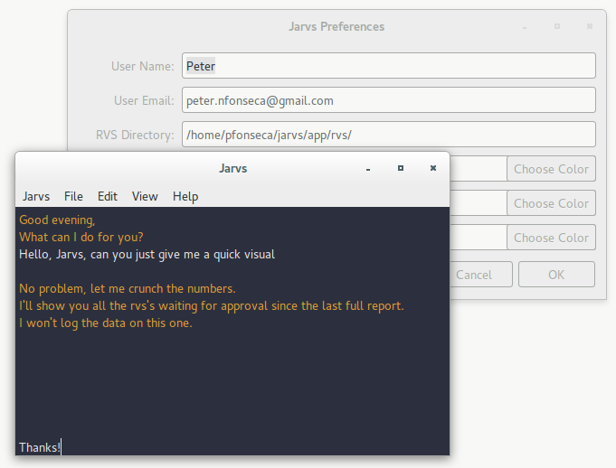

## Jarvs

#### Jarvs is a research visist summary management system, build with large-scale clinical research in mind.

At the moment, the GitHub version of Jarvs works on both os x and linux operating systems, but it is being transitioned into an Ubuntu application. Development is not yet stable, but is functional. Users have two options in the meantime:
* Use the stable tkinter-based GitHub version with a simple `git clone http://github.com/fonsecapeter/jarvs` in your home directory (os x or linux)
  * This will require the user to `cd ~/jarvs/app` then `./gui.py` to run the program

or

* Patiently follow the development of the GTK-based [Ubuntu release](http://launchpad.net/jarvs) with a more familiar:
```bash
sudo add-apt-reposoity ppa:peter-nfonseca/jarvs
sudo apt-get update
sudo apt-get install jarvs
``` 
  * Updates are as simple as `sudo apt-get update` then `sudo apt-get upgrade`
  * Running is as simple as clicking the icon (in accessories) or typing `jarvs` into a terminal

Either way, the first order of business will be configuring settings. Jarvs has a terminal-like text display, which operates through natural language commands (all lower-case for now), ad well as standard gui main-menu drop downs.
"User Email" and "RVS Directory" are the important bits. (RVS Directory takes an absolute path, ending in "/" - file chooser dialog to come)

After that, just set the attendings (give their information in the contacts-like dialog - "Direcoty Name" is the important one here and should end in "/" - this one is just the name of the terminal directory, not the full absolute path)

Now Jarvs is ready to help save manage research visit summaries (RVSs). There are four main featurs: 
1. Optional directory set-up (still in development on the ubuntu release)
2. Reporting (logs which attendings have outstanding RVSs in a spreadshet - RVS_report.csv)
3. Data Visualization (visualizes the most recent entry in RVS_report.csv)
4. Weekly Emails (uses crontab to send weekly emails to the attendings who have outstanding RVSs)

Obligatory screenshot:



Jarvs started life as a terminal-app, including a quick description of what an RVS is and what an RVS manager has to do:

> dependencies:
mac os x or linux-based operating system, bash shell, python 2, matplotlib, pandas, numpy, recommend  anaconda (comes with all python libraries and more), gcalcli
>> if using linux: weather-util, weather-util-data
>>
>> if using mac: coreutils, recommend also using homebrew package manager
