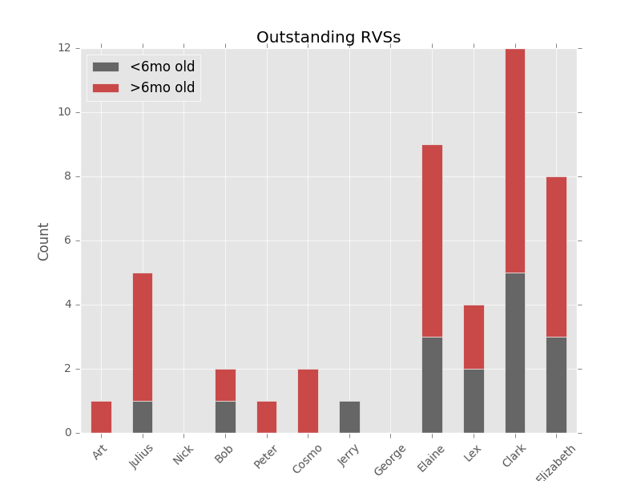

## Jarvs

#### Jarvs is a personal assistant living the terminal that was initially built to be a 'JARVIS' for rvs management.

 > The code written to support the rvs program is immortalized within jarvs, containing a clone of the real rvs server. See the rvs repository for more detail on the rvs code, though it is included in Jarvs.

Jarvs is currently programmed to also contain very useful utilities, such as the current date, ical (and gcal if synced) appointments, and weather information (in San Francisco). I sourced all of these utilities from pre-existing tools, just putting them all together in an easily accessible way. More utilities are in the works and full Linux/Mac cross-compatibility is underway. As such, some of the utility functions are set to only work in one OS, though the plan is to move away from this.

Jarvs also remembers a few basic preferences that can be changed.

A detailed description of the rvs program (what an rvs is and what the rvs manager does) can be explained by jarvs as below:

* What is an rvs?
```
An rvs is a research visit summary.
It includes the entire life-hisotry of the particpant
in a semi-standard fashion, organized by history of
present illness, medical history, social history, family
history, lab testing, imaging, and more.
These rvs's make up a vital resource for researchers and
participants. Each participant gets a copy of their rvs
and lists a primary doctor (or doctors) who also get a
copy. The research center serves as a team of experts
devoted to diseases that are otherwise not well-described
or are rare, so their advice is cliniclally relevent to
the participant's continued clinical care.
In a large research project, many research participants
come in for visits. During a visit, the participant will
see different researchers and clinicians. A visit is
always overseen by an attending physician (attending), who
must give final approval of the rvs.
```

* What does the rvs manger do?
```
You must be the rvs manager, a clinical research
coordinator responsible for overseeing the rvs program.
It is crucial to ensure that every note is written,
approved, sent, and archived. This can be a source of
contention if it is not running smoothly. Particpants
contribute a full week of 9-5 work, often including
specimen donation and a flight across the country. The
rvs is one ofthe only ways we can give back. Along that
vein, the advice within is not clinically relevent after
6 months and there are many governing rules to what can
disclosed. The rvs manager must make sure the center is
complient and efficient.

This task is greater than anticipated, especially considering
the growth of the study, so Peter made me to help. I can
currently assist on the attending side of things, producing
and logging reports, as well as sending weekly reminders to
any attending with at least one outstanding rvs.

A graphical explanation of the flow of an rvs can be seen here:
```

<a href="url"></a>

```
This follows the life of 12377's rvs from January 4th, 2016.
I would have sent Dr. Hibbert this email:

-----Original Message-----
From: peter fonseca 
Sent: Monday, January 11, 2016 11:36 AM
To: Hibbert, Julius
Subject: Overdue RVS's

Dr. Julius Hibbert,
You have [5] RVS's outstanding. [4] of these are overdue, please approve.

  1183 from 2015-04-12 is OVERDUE
  12306 from 2015-01-14 is OVERDUE
  12377 from 2016-01-04 is due 2016-01-25
  12705 from 2015-06-17 is OVERDUE
  13191 from 2015-03-06 is OVERDUE

Files are in rvs/Outstanding/Hibbert,Julius

Do not reply to this email, please contact Peter.Fonseca@notarealemailaddress.com if you have any questions.

---------------------------

I also would have shown you this report:
```



> dependencies: 
mac os x or linux-based operating system, bash shell, python 2, matplotlib, pandas, recommend  anaconda (comes with all python libraries and more)
>> if using linux:
weather-util, weather-util-data
>> if using mac:
coreutils, icalbuddy, recommend also using homebrew package manager
