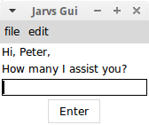

## Jarvs

#### Jarvs is a personal assistant living the terminal that was initially built to be a 'JARVIS' for rvs management.

 > The code written to support the rvs program is immortalized within jarvs, containing a clone of the real rvs server with fake names and data. See the rvs repository for more detail on rvs-related code.

Jarvs is currently programmed to also contain a number of utilities, such as the current date, gcoogle calendar appointments, and weather information (in San Francisco). I sourced all of these utilities from pre-existing tools, just putting them together in an easily accessible way. More utilities are in the works. My work computer runs a Linux operating system and I use a mac-book at home, so Jarvs is fully Linux/Mac cross-compatibile.

Here is Jarvs helping me out while I'm at work:

Here is Jarvs helping me out from home:

Jarvs also remembers a few basic preferences that can be changed.

At work, Jarvs will pull the real rvs data and commands, but at home, Jarvs works off of the clone. A detailed description of the rvs program (what an rvs is and what the rvs manager does) can be explained by jarvs as below:

A gui is in the works...

> dependencies:
mac os x or linux-based operating system, bash shell, python 2, matplotlib, pandas, recommend  anaconda (comes with all python libraries and more), gcalcli
>> if using linux: weather-util, weather-util-data
>>
>> if using mac: coreutils, recommend also using homebrew package manager
