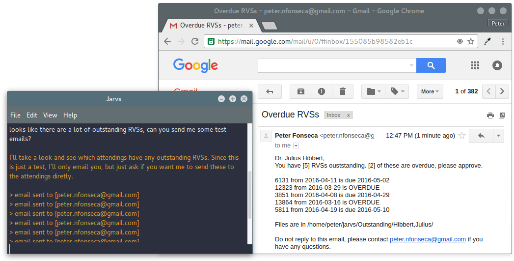

## Jarvs

#### Jarvs is a research visist summary management system, build with large-scale clinical research in mind.

At the moment, the master branch works on both os x and linux operating systems, but is being depreciated for the Ubuntu application. Development is not yet finished, but is functional. Users have two options in the meantime:
* Use the depreciated tkinter-based master branch version with `git clone http://github.com/fonsecapeter/jarvs` in your home directory (os x or linux)
  * This will require the user to `cd ~/jarvs/app` then `./gui.py` to run the program
  * Dependencies may be needed

or

* Follow the development of the GTK-based [Ubuntu release](http://launchpad.net/jarvs) with a more familiar:
```bash
sudo add-apt-reposoity ppa:peter-nfonseca/jarvs
sudo apt-get update
sudo apt-get install jarvs
```
  * Updates are as simple as `sudo apt-get update` then `sudo apt-get upgrade`
  * Running is as simple as clicking the icon (in accessories) or typing `jarvs` into a terminal
    * The first startup may take a littel extra time, just be patient - using the terminal on this first startup will give some helpful details about what is happening (building ~/.jarvs and it's contents)
    > if anything goes wrong, you may need to `sudo apt-get python-gobject` and/or change the software source to match `universe trusty`
    
> you can always grab the latest tar.gz by navigating to the [Releases Tab](https://github.com/fonsecapeter/jarvs/releases)

Either way, the first order of business will be configuring settings. Jarvs has a terminal-like text display, which operates through natural language commands (all lower-case for now), as well as standard gui main-menu drop downs.


(RVS Directory takes an absolute path, ending in "/" - file chooser dialog to come.)
> Spaces are currently not supported in this path

After that, just set the attendings


("Directory Name" should end in "/" - this is the name of the folder inside RVS Directory)
> Spaces also not currently supported

The optional directory set-up feature is still in the works, but at this point you should either already have or should go set up your RVS directory, which should have a folder for each attending. Each of these folders will hold the RVSs (usually .doc or .docx). It is very important that each RVS is named exactly under the convention `Lname, Fname_pidn_yyyy.mm.dd_RVS`

Once you are all set, you can run your first report.


After that, Jarvs can visualize the latest entry in that report - which is great for just keeping an eye on the attendings or even using as a motivational tool (if you work with a friednly, competitive group).


If there are a lot of RVSs waiting for approval, it might be a good idea to let Jarvs email a friendly reminder to the attendings who have outstanding RVSs. If this is the first time, you might want to send out some test emails that only go to your email (the one you provided in your preferences)



If that looks good to you, give jarvs the green-light to send them out to the attenings.


Because these core features run off of bash scripts (in ~/.jarvs) - you can set up some very helpful crontab jobs. I keep a weekly email every monday at 10:00 am and a matching report. To set this up, just open a terminal and type `crontab -e` - this will open the crontab in nano. Go to the bottom (after all the lines beginning with `#`) and add your commands. I added:
```bash
0 10 * * mon /home/peter/.jarvs/RVS_emailer.sh
0 10 * * mon /home/peter/.jarvs/RVS_reporter.sh
```

This translates in english to: at 0 minutes after 10am (any day of month, any month of year) on every Monday, run the emailer and reporter scripts in the ~/.jarvs directory. When you are done adding those lines, press `<ctrl^O>` to save, `<enter>` to select the right place to save (will auto-choose the right spot), then `<ctrl^X>` to exit nano. You can verify that it saved by typing `crontab -l` into the terminal.

You can also always add a `#` before the line that you want to "turn-off" if you need to.

> ubuntu version dependencies (will resolve with install): python 2, matplotlib 1.5, pandas, numpy

> github version dependencies:
mac os x or linux-based operating system, bash shell, python 2, matplotlib, pandas, numpy, recommend  anaconda (comes with all python libraries and more), gcalcli
>> if using linux: weather-util, weather-util-data
>>
>> if using mac: coreutils, recommend also using homebrew package manager
